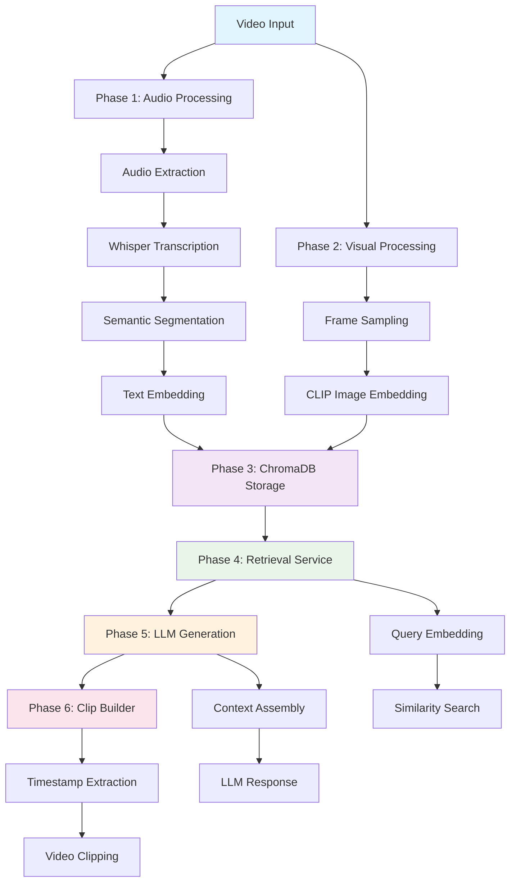

# 🎬 Multimodal Video RAG Pipeline

A complete **Retrieval-Augmented Generation (RAG) system** for video content that combines audio transcription and visual frame analysis to enable intelligent querying of video libraries.

> **Inspired by:** [NVIDIA's Multimodal RAG Guide](https://developer.nvidia.com/blog/an-easy-introduction-to-multimodal-retrieval-augmented-generation-for-video-and-audio/)

## ✨ Features

- 🎵 **Audio Processing**: Whisper-based transcription with semantic segmentation
- 🖼️ **Visual Analysis**: CLIP-based frame embedding and analysis  
- 🗃️ **Vector Storage**: ChromaDB for efficient similarity search
- 🔍 **Intelligent Retrieval**: Multimodal search across audio and visual content
- ⚡ **Local Processing**: Runs entirely offline without external APIs
- 🐍 **Pure Python**: Clean, modular architecture with comprehensive testing

## 🏗️ Architecture Overview



## 🚀 Quick Start

### Prerequisites

- **Python 3.9-3.12** (⚠️ ChromaDB compatibility issues with Python 3.13+)
- **FFmpeg** (for video/audio processing)
- **Git** (for cloning)

### Installation

#### 1. Python Setup (Recommended: pyenv)

```bash
# Install pyenv if not already installed
curl https://pyenv.run | bash

# Install Python 3.11 (recommended for ChromaDB compatibility)
pyenv install 3.11.7
pyenv local 3.11.7

# Verify Python version
python --version  # Should show Python 3.11.7
```

#### 2. Clone and Setup

```bash
git clone <repository-url>
cd video-rag-pipeline

# Create virtual environment (Windows)
python -m venv venv
venv/Scripts/Activate.ps1  # PowerShell
# venv\Scripts\activate.bat  # Command Prompt

# Create virtual environment (macOS/Linux)
python -m venv venv
source venv/bin/activate

# Install dependencies
pip install -r requirements.txt
```

#### 3. ChromaDB Version Compatibility

Our pipeline uses the **latest ChromaDB API** (v1.0+). Key compatibility notes:

- ✅ **ChromaDB 1.0+**: Full compatibility with new `PersistentClient` API
- ❌ **ChromaDB 0.4.x**: Uses deprecated `Client(settings)` API  
- ⚠️ **Python 3.13**: Known ChromaDB compatibility issues
- ✅ **Python 3.9-3.12**: Fully supported

```bash
# Verify ChromaDB installation
python -c "import chromadb; print('ChromaDB version:', chromadb.__version__)"
```

### 🎯 Basic Usage

#### Run Complete Pipeline

```bash
# Process a video through all phases
python driver.py --video your_video.mp4

# With verbose logging
python driver.py --video your_video.mp4 --verbose
```

#### Verify Results

```bash
# Inspect stored embeddings
python verify_chromadb_embeddings.py

# Search your video content
python verify_chromadb_embeddings.py --action search --query "machine learning"

# Export embedding summary
python verify_chromadb_embeddings.py --action export --output summary.json
```

## 📁 Project Structure

```
Video RAG Pipeline/
├── 📂 src/                          # Core pipeline modules
│   ├── 📂 phase1_audio/             # Audio processing & embedding
│   │   ├── extract_transcribe.py    # Whisper transcription
│   │   ├── segment_transcript.py    # Text segmentation
│   │   └── embed_text.py           # Text embedding
│   ├── 📂 phase2_visual/            # Visual processing & embedding  
│   │   ├── sample_frames.py         # Frame extraction
│   │   └── embed_frames.py          # Image embedding
│   ├── 📂 phase3_db/                # ChromaDB integration
│   │   ├── client.py               # Vector store client
│   │   ├── ingest.py               # Batch ingestion
│   │   ├── models.py               # Data models
│   │   └── retriever.py            # Search & retrieval
│   ├── 📂 phase4_retriever/         # Query processing
│   ├── 📂 phase5_generation/        # LLM integration
│   └── 📂 phase6_clipper/           # Video clipping
├── 📂 data/                         # Processed data
│   ├── transcripts/                # Audio transcripts
│   ├── embeddings/                 # Vector embeddings
│   ├── frames/                     # Extracted frames
│   └── chroma/                     # ChromaDB storage
├── 📂 tests/                        # Test suite
├── driver.py                       # Main pipeline driver
├── verify_chromadb_embeddings.py   # Database verification
└── requirements.txt                # Python dependencies
```

## 🔧 Detailed Phase Breakdown

### Phase 1: Audio Processing Pipeline 
- **Audio Extraction**: FFmpeg-based audio track extraction
- **Speech Transcription**: OpenAI Whisper with word-level timestamps
- **Semantic Segmentation**: Intelligent text chunking (5-15s segments)
- **Text Embedding**: CLIP text encoder for semantic vectors

### Phase 2: Visual Processing Pipeline
- **Frame Sampling**: Extract keyframes every 10 seconds
- **Image Embedding**: CLIP image encoder (ViT-B-32)
- **Metadata Association**: Timestamp and location tracking

### Phase 3: Vector Database
- **ChromaDB Storage**: Persistent local vector database
- **Unified Schema**: Audio and visual embeddings in single collection
- **Batch Ingestion**: Efficient bulk data loading
- **Similarity Search**: Cosine similarity for content retrieval

### Phase 4: Retrieval System
- **Query Embedding**: Real-time query vectorization
- **Multimodal Search**: Combined audio/visual similarity search
- **Result Ranking**: Relevance-based result ordering

### Phase 5: Generation Pipeline
- **Context Assembly**: Relevant segment compilation
- **LLM Integration**: Natural language response generation
- **Citation**: Timestamp and source attribution

### Phase 6: Video Clipping
- **Timestamp Extraction**: Parse time references from responses
- **Clip Generation**: Extract relevant video segments
- **Multi-format Export**: Various output formats supported

## 🔍 Usage Examples

### Search Video Content

```python
from src.phase3_db.client import VectorStoreClient
from src.phase3_db.retriever import VectorRetriever

# Initialize retriever
client = VectorStoreClient()
retriever = VectorRetriever(vector_client=client)

# Search for content
response = retriever.search_by_text("machine learning tutorial", k=5)

for result in response.results:
    print(f"📍 {result.get_timing_info()}")
    print(f"   Content: {result.content[:100]}...")
    print(f"   Score: {result.similarity_score:.3f}\n")
```

### Process Multiple Videos

```python
import glob
from pathlib import Path

# Process all videos in a directory
for video_path in glob.glob("videos/*.mp4"):
    print(f"Processing {video_path}...")
    # Run driver programmatically or via subprocess
```

## 📊 Performance Metrics

Based on test video (4.5MB, ~50s duration):

| Phase | Processing Time | Output |
|-------|----------------|---------|
| **Phase 1** | ~23.5s | 8 audio segments, 512D embeddings |
| **Phase 2** | ~3.5s | 6 frame segments, 512D embeddings |  
| **Phase 3** | ~0.4s | 14 total segments in ChromaDB |
| **Total** | **~27.4s** | **Complete searchable database** |

**Search Performance**: ~100ms per query with sub-second result ranking

## 🛠️ Development & Testing

### Run Test Suite

```bash
# Run all tests
python -m pytest tests/ -v

# Test specific phases
python -m pytest tests/test_phase1_audio.py -v
python -m pytest tests/test_phase3_vector_store.py -v
```

### Manual Testing

```bash
# Test Phase 3 manually
python test_phase3_manual.py

# Verify ChromaDB functionality
python test_chromadb_minimal.py
```

### Debug Pipeline

```bash
# Check pipeline report
cat pipeline_report.json

# View ChromaDB contents
python verify_chromadb_embeddings.py --action inspect

# Export detailed summary
python verify_chromadb_embeddings.py --action export
```

## 🔧 Configuration

### Environment Variables

```bash
# Optional: Set custom paths
export CHROMA_PERSIST_DIR="custom/chroma/path"
export VIDEO_DATA_DIR="custom/data/path"

# Optional: Model settings
export WHISPER_MODEL="base"  # or "small", "medium", "large"
export CLIP_MODEL="ViT-B-32"
```

### Model Configuration

- **Whisper Model**: `base` (fast) to `large` (accurate)
- **CLIP Model**: `ViT-B-32` (balanced) or `ViT-L-14` (high-quality)
- **Embedding Dimension**: 512 (ViT-B-32) or 768 (ViT-L-14)

## 🐛 Troubleshooting

### Common Issues

#### ChromaDB Version Conflicts
```bash
# Error: "deprecated configuration of Chroma"
pip install --upgrade chromadb

# If issues persist, reinstall
pip uninstall chromadb
pip install chromadb>=1.0.0
```

#### Python 3.13 Compatibility
```bash
# Use Python 3.11 instead
pyenv install 3.11.7
pyenv local 3.11.7
```

#### FFmpeg Not Found
```bash
# Windows: Install via chocolatey
choco install ffmpeg

# macOS: Install via homebrew  
brew install ffmpeg

# Ubuntu/Debian
sudo apt update && sudo apt install ffmpeg
```

#### Memory Issues
```bash
# Reduce batch sizes in code
# Phase 1: batch_size=8 (default: 16)
# Phase 2: batch_size=16 (default: 32)
```

### Debug Mode

```bash
# Enable detailed logging
python driver.py --verbose

# Check specific components
python -c "
from src.phase3_db.client import VectorStoreClient
client = VectorStoreClient()
print('ChromaDB client working:', client.get_collection_info())
"
```

## 🤝 Contributing

1. **Fork** the repository
2. **Create** a feature branch (`git checkout -b feature/amazing-feature`)
3. **Run tests** (`python -m pytest`)
4. **Commit** changes (`git commit -m 'Add amazing feature'`)
5. **Push** to branch (`git push origin feature/amazing-feature`)
6. **Open** a Pull Request

## 📄 License

This project is licensed under the MIT License - see the [LICENSE](LICENSE) file for details.

## 🙏 Acknowledgments

- **NVIDIA** for the [Multimodal RAG tutorial](https://developer.nvidia.com/blog/an-easy-introduction-to-multimodal-retrieval-augmented-generation-for-video-and-audio/)
- **OpenAI** for Whisper speech recognition
- **OpenCLIP** team for CLIP implementations  
- **ChromaDB** team for the vector database
- **FFmpeg** community for video processing tools

## 📈 Roadmap

- [ ] **Web Interface**: Browser-based query interface
- [ ] **API Server**: REST API for remote access
- [ ] **Cloud Storage**: S3/GCS integration for large video libraries
- [ ] **Real-time Processing**: Live video stream analysis
- [ ] **Multi-language**: Support for non-English content
- [ ] **Advanced Retrieval**: Hybrid search with metadata filtering

---

> 🚀 **Ready to build your own Video RAG system?** Follow the installation guide and start processing your first video! 