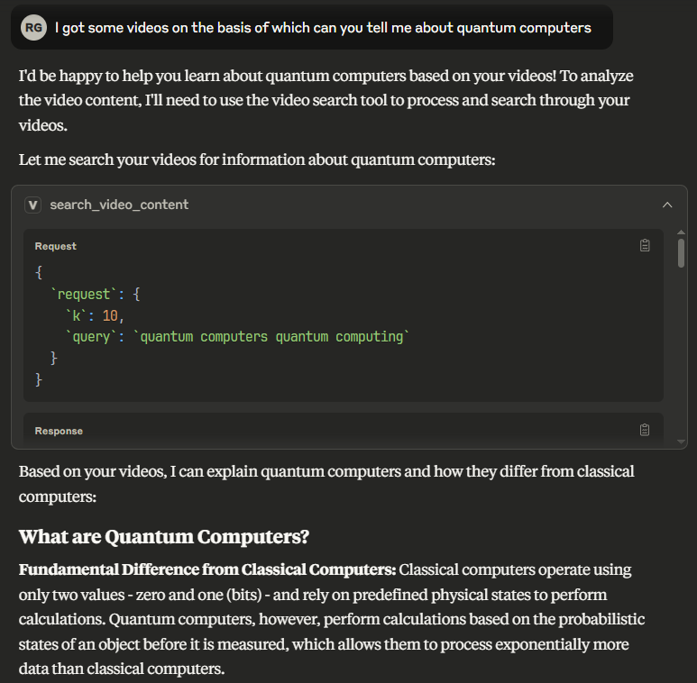
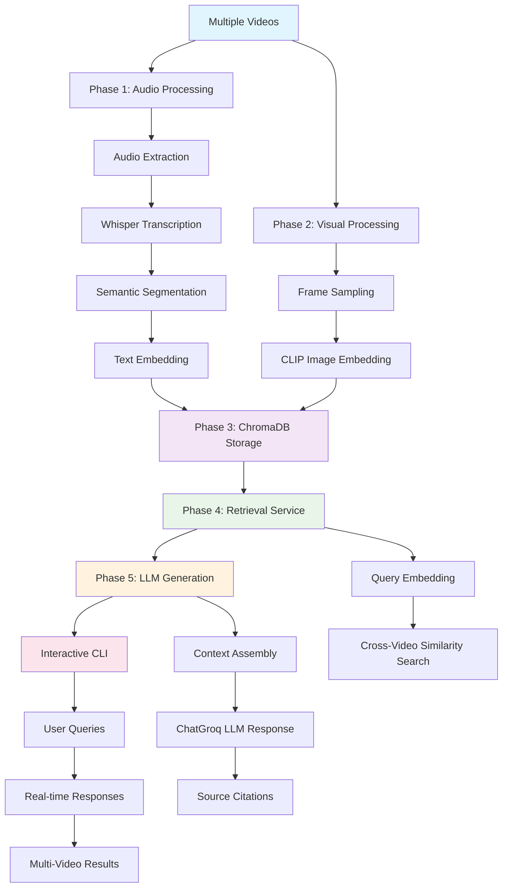

   # Video RAG with MCP

*Multimodal video search for Claude Desktop through Model Context Protocol*

**Inspired by:** [NVIDIA's Multimodal RAG Guide](https://developer.nvidia.com/blog/an-easy-introduction-to-multimodal-retrieval-augmented-generation-for-video-and-audio/)

[](https://python.org)
[](https://modelcontextprotocol.io)
[](LICENSE)

## Overview

Transform videos into searchable knowledge through audio transcription and visual analysis. Integrated with Claude Desktop via MCP for natural language video queries.

<div align="center">
  
</div>

## Features

**🎬 Multimodal Processing**
- Audio transcription with Whisper
- Visual frame analysis with CLIP
- Semantic segmentation and embedding

**🔍 Intelligent Search**
- Natural language queries
- Cross-modal content retrieval
- Multi-video support

**🤖 Claude Integration**
- MCP server for Claude Desktop
- Real-time video content search
- Contextual responses with citations

<div align="center">
  
</div>

## Quick Start

### Prerequisites

```bash
python 3.11 - REQUIRED --> because 3.13 has commpatibility issues with ChromaDB
```

### Installation

```bash
# Clone repository
git clone https://github.com/rohan-g0re/Video_RAG_x_MCP.git
cd Video_RAG_x_MCP

# Install dependencies
uv add -r requirements.txt

# Add videos
mkdir -p videos
cp your_videos.mp4 videos/
```

### Usage

**Add to Claude Desktop config:**

```json
{
  "mcpServers": {
   "video-rag": {
      "command": "uv",
      "args": [
        "--directory",
        "<your_path>",
        "run",
        "mcp_server.py"
      ]
    }
  }
}
```

## Architecture

```
Videos → [Audio + Visual Processing] → Vector DB → MCP Server → Claude Desktop
```

- **Phase 1**: Audio transcription and semantic segmentation
- **Phase 2**: Frame extraction and visual embedding  --> _**Can add VLM Integration for adding captions to images**_
- **Phase 3**: ChromaDB vector storage
- **Phase 4**: Multimodal retrieval service
- **MCP**: Claude Desktop integration




## Configuration

| Component | Technology | Purpose |
|-----------|------------|---------|
| Dealing with Audio Channel | Whisper | Extraction and Transcription |
| Dealing with Visual Channel | CLIP ViT-B/32 | Frame Extraction |
| Storage | ChromaDB | Vector database |
| MCP Server | FastMCP | Claude Tool Integration |

## Supported Formats

Video: `.mp4`, `.avi`, `.mov`, `.mkv`, `.wmv`, `.flv`, `.webm`

## Requirements

- uv
- Python 3.11

---

<div align="center">
Ready to search your videos? Add them to `videos/` and connect with Claude Desktop.
</div>