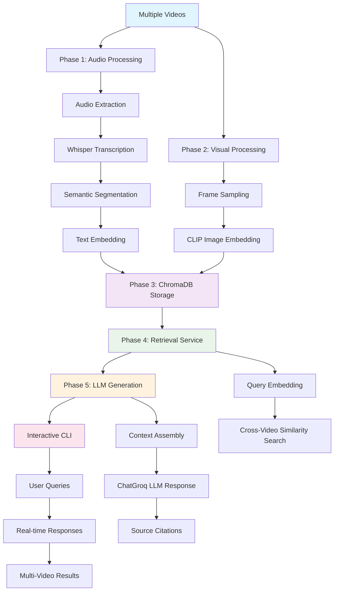

# 🎬 Multimodal Video RAG Pipeline

A complete **Retrieval-Augmented Generation (RAG) system** for video content that combines audio transcription and visual frame analysis to enable intelligent querying of video libraries with **multi-video support** and **LLM-powered responses**.

> **Inspired by:** [NVIDIA's Multimodal RAG Guide](https://developer.nvidia.com/blog/an-easy-introduction-to-multimodal-retrieval-augmented-generation-for-video-and-audio/)

## ✨ Features

- 🎵 **Audio Processing**: Whisper-based transcription with semantic segmentation
- 🖼️ **Visual Analysis**: CLIP-based frame embedding and analysis  
- 🗃️ **Vector Storage**: ChromaDB for efficient similarity search
- 🔍 **Intelligent Retrieval**: Multimodal search across audio and visual content
- 🤖 **LLM Generation**: ChatGroq integration with Llama-3.1-8b-instant for natural language responses
- 📽️ **Multi-Video Support**: Process and query multiple videos simultaneously
- 💬 **Interactive CLI**: Real-time querying with LLM generation and source citations
- ⚡ **Local Processing**: Audio/visual processing runs offline, LLM via ChatGroq API
- 🐍 **Pure Python**: Clean, modular architecture with comprehensive testing

## 🏗️ Architecture Overview



## 🚀 Quick Start

### Prerequisites

- **Python 3.9-3.12** (⚠️ ChromaDB compatibility issues with Python 3.13+)
- **FFmpeg** (for video/audio processing)
- **ChatGroq API Key** (for LLM generation - free tier available)
- **Git** (for cloning)

### Installation

#### 1. Python Setup (Recommended: pyenv)

```bash
# Install pyenv if not already installed
curl https://pyenv.run | bash

# Install Python 3.11 (recommended for ChromaDB compatibility)
pyenv install 3.11.7
pyenv local 3.11.7

# Verify Python version
python --version  # Should show Python 3.11.7
```

#### 2. Clone and Setup

```bash
git clone <repository-url>
cd video-rag-pipeline

# Create virtual environment (Windows)
python -m venv venv
venv/Scripts/Activate.ps1  # PowerShell
# venv\Scripts\activate.bat  # Command Prompt

# Create virtual environment (macOS/Linux)
python -m venv venv
source venv/bin/activate

# Install dependencies
pip install -r requirements.txt
```

#### 3. Environment Setup

```bash
# Create .env file for ChatGroq API
echo "GROQ_API_KEY=your_api_key_here" > .env

# Get free API key from: https://console.groq.com/
```

#### 4. Video Setup

```bash
# Add your videos to the videos directory
cp your_video1.mp4 videos/
cp your_video2.mp4 videos/
# Supports: .mp4, .avi, .mov, .mkv, .wmv, .flv, .webm
```

### 🎯 Basic Usage

#### Process Multiple Videos

```bash
# Process all videos in the videos/ directory
python driver.py

# Or specify custom directory
python driver.py --video custom_videos/
```

The pipeline will:
1. 📁 **Discover** all video files in the directory
2. 🎵 **Process** each video through audio analysis (Phase 1)
3. 🖼️ **Extract** and analyze frames from each video (Phase 2)  
4. 🗃️ **Store** all embeddings in ChromaDB with unique video IDs (Phase 3)
5. 💬 **Launch** interactive CLI for cross-video querying

#### Interactive Querying

After processing, you'll enter an interactive mode:

```
🔍 INTERACTIVE QUERY MODE (with LLM Generation)
🤖 LLM Generation: ENABLED (ChatGroq Llama-3.1-8b-instant)

🤖 Query: What topics are discussed across the videos?

✅ AI Answer (generated in 2.341s):
============================================================
Based on the video segments, the topics discussed include:

1. **Artificial Intelligence and Machine Learning** [test_video_2: 43.3s-53.2s] 
   - The videos explain AI concepts and their everyday applications

2. **Technology Decision-Making** [test_video_2: 20.3s-28.2s]
   - How computers make decisions that affect daily life

3. **Learning and Knowledge** [test_video_2: 158.0s-162.4s]
   - The importance of gaining hands-on experience with tools
============================================================

📚 Sources (6 segments):
   1. [test_video_2: 26.8s-34.4s] AUDIO
      💬 When you do an internet search or scroll through your...
   2. [test_video_1: 34.5s-41.2s] AUDIO  
      💬 This is your hate in this life, man! Oh, man!...
```

#### Commands

- `help` - Show available commands
- `stats` - Display database statistics  
- `llm` - Toggle between LLM and retrieval-only mode
- `quit` / `exit` - Exit the program

## 📁 Project Structure

```
Video RAG Pipeline/
├── 📂 videos/                       # 📽️ Video files directory
│   ├── .gitkeep                     # Preserves directory in git
│   ├── your_video1.mp4              # (ignored by git)
│   └── your_video2.mp4              # (ignored by git)
├── 📂 src/                          # Core pipeline modules
│   ├── 📂 phase1_audio/             # Audio processing & embedding
│   │   ├── extract_transcribe.py    # Whisper transcription
│   │   ├── segment_transcript_semantic.py # Semantic segmentation
│   │   └── embed_text_semantic.py   # Text embedding with caption preservation
│   ├── 📂 phase2_visual/            # Visual processing & embedding  
│   │   ├── sample_frames.py         # Frame extraction
│   │   └── embed_frames.py          # Image embedding
│   ├── 📂 phase3_db/                # ChromaDB integration
│   │   ├── client.py               # Vector store client
│   │   ├── ingest.py               # Batch ingestion
│   │   └── models.py               # Data models
│   ├── 📂 phase4_retriever/         # Query processing & retrieval
│   │   ├── retriever.py            # Multi-video search & retrieval
│   │   ├── models.py               # Document models
│   │   └── embed_query.py          # Query embedding
│   ├── 📂 phase5_generation/        # LLM integration
│   │   ├── qa_service.py           # FastAPI QA service
│   │   ├── llm_integration.py      # ChatGroq LLM integration
│   │   └── prompt_templates.py     # System prompts & formatting
│   └── 📂 phase6_clipper/           # Video clipping (future)
├── 📂 data/                         # Processed data
│   ├── transcripts/                # Audio transcripts (per video)
│   ├── embeddings/                 # Vector embeddings (per video)
│   ├── frames/                     # Extracted frames (per video)
│   └── chroma/                     # ChromaDB storage (unified)
├── 📂 tests/                        # Test suite
├── driver.py                       # 🚀 Main multi-video pipeline
├── requirements.txt                # Python dependencies
└── .gitignore                      # Ignores video files, keeps structure
```

## 🔧 Detailed Phase Breakdown

### Phase 1: Audio Processing Pipeline 
- **Multi-Video Audio Extraction**: FFmpeg-based processing for each video
- **Speech Transcription**: OpenAI Whisper with word-level timestamps
- **Semantic Segmentation**: Intelligent text chunking (5-15s segments)
- **Text Embedding**: CLIP text encoder with **caption preservation**
- **Unique Video IDs**: Each video gets distinct identifier for cross-video queries

### Phase 2: Visual Processing Pipeline
- **Multi-Video Frame Sampling**: Extract keyframes every 10 seconds per video
- **Image Embedding**: CLIP image encoder (ViT-B-32) 
- **Video-Specific Metadata**: Timestamp and video ID tracking

### Phase 3: Unified Vector Database
- **ChromaDB Storage**: Single collection with multi-video support
- **Unique Video IDs**: Prevents conflicts between videos
- **Batch Ingestion**: Efficient processing of multiple videos
- **Cross-Video Search**: Query across all videos simultaneously

### Phase 4: Multi-Video Retrieval System
- **Query Embedding**: Real-time query vectorization
- **Cross-Video Search**: Retrieve relevant segments from any video
- **Video-Specific Filtering**: Option to search within specific videos
- **Result Ranking**: Relevance-based ordering across all videos

### Phase 5: LLM Generation Pipeline ⭐
- **ChatGroq Integration**: Llama-3.1-8b-instant model
- **Context Assembly**: Multi-video segment compilation
- **Source Citations**: Automatic timestamp and video ID attribution
- **Temperature=0**: Deterministic, fact-focused responses
- **Async Processing**: Non-blocking LLM generation

## 🔍 Usage Examples

### Multi-Video Search

```python
from phase4_retriever import search_videos

# Search across all videos
results = search_videos("machine learning", k=10)

for doc in results:
    video_id = doc.metadata['video_id']
    timing = doc.get_timing_info()
    content = doc.page_content[:100]
    
    print(f"📹 {video_id} [{timing}]: {content}...")
```

### Video-Specific Search

```python
from phase4_retriever import Retriever

retriever = Retriever()

# Search within specific video
video1_results = retriever.search_by_video("AI concepts", "video1", k=5)
video2_results = retriever.search_by_video("AI concepts", "video2", k=5)

print(f"Video 1: {len(video1_results)} results")
print(f"Video 2: {len(video2_results)} results")
```

### LLM Generation

```python
import asyncio
from phase5_generation import QAService, QARequest

async def query_videos():
    qa_service = QAService()
    
    request = QARequest(
        question="What are the main themes across these videos?",
        k=8,
        include_audio=True,
        include_visual=True
    )
    
    response = await qa_service.process_question(request)
    
    print(f"Answer: {response.answer}")
    print(f"Sources from {len(set(s.video_id for s in response.sources))} videos")
    
    for source in response.sources:
        print(f"  📹 {source.video_id} [{source.start:.1f}s-{source.end:.1f}s]")

# Run async function
asyncio.run(query_videos())
```

## 📊 Performance Metrics

**Multi-Video Processing** (2 videos: 4.5MB + 6.3MB, ~100s total):

| Phase | Processing Time | Output |
|-------|----------------|---------|
| **Phase 1** | ~45s | 27 audio segments across videos |
| **Phase 2** | ~8s | 24 frame segments across videos |  
| **Phase 3** | ~1.2s | 51 total vectors in ChromaDB |
| **Total** | **~54.2s** | **Complete multi-video database** |

**Query Performance**:
- **Retrieval**: ~150ms per cross-video query
- **LLM Generation**: ~2-4s per response (ChatGroq Llama-3.1-8b)
- **Interactive Mode**: Real-time responsiveness

## 🛠️ Development & Testing

### Environment Variables

```bash
# Required: ChatGroq API key
GROQ_API_KEY=your_groq_api_key

# Optional: Custom paths
CHROMA_PERSIST_DIR="custom/chroma/path"
VIDEO_DATA_DIR="custom/data/path"

# Optional: Model settings
WHISPER_MODEL="base"  # or "small", "medium", "large"
CLIP_MODEL="ViT-B-32"
```

### Manual Testing

```bash
# Test multi-video database
python -c "
from src.phase3_db.client import VectorStoreClient
client = VectorStoreClient()
info = client.get_collection_info()
videos = client.list_videos()
print(f'Total vectors: {info[\"count\"]}, Videos: {videos}')
"

# Test cross-video retrieval
python -c "
from phase4_retriever import Retriever
retriever = Retriever()
results = retriever.search('content', k=5)
videos = set(doc.metadata['video_id'] for doc in results)
print(f'Results from {len(videos)} videos: {videos}')
"
```

## 🐛 Troubleshooting

### Common Issues

#### ChatGroq API Issues
```bash
# Error: "GROQ_API_KEY not found"
echo "GROQ_API_KEY=your_key_here" > .env

# Test API connection
python -c "
from phase5_generation.llm_integration import ChatGroqLLM
llm = ChatGroqLLM()
print('ChatGroq connection:', llm.health_check())
"
```

#### Multi-Video Processing Issues
```bash
# Error: No videos found
ls videos/  # Check videos directory exists and has files

# Check supported formats
echo "Supported: .mp4, .avi, .mov, .mkv, .wmv, .flv, .webm"
```

#### ChromaDB Multi-Video Conflicts
```bash
# Clear database if needed
python -c "
from src.phase3_db.client import VectorStoreClient
client = VectorStoreClient()
client.collection.delete()  # Nuclear option
"
```

### Debug Mode

```bash
# Enable detailed logging
python driver.py --verbose

# Check multi-video processing
python -c "
from driver import LeanVideoRAGDriver
driver = LeanVideoRAGDriver('videos')
print(f'Found videos: {[v.name for v in driver.video_files]}')
"
```

## 🌟 Key Improvements

### ✅ What's New in This Version

- **🎬 Multi-Video Support**: Process and query multiple videos simultaneously
- **🤖 ChatGroq LLM Integration**: Natural language responses with source citations
- **💬 Interactive CLI**: Real-time querying with LLM generation toggle
- **🔍 Cross-Video Retrieval**: Search across all videos in unified queries
- **📁 Smart File Management**: Videos directory with .gitignore for version control
- **🎯 Enhanced Retrieval**: Video-specific and modality-specific search options
- **📊 Comprehensive Statistics**: Multi-video database insights and performance metrics

### 🚀 Usage Highlights

1. **Drop multiple videos** in the `videos/` directory
2. **Run single command** to process all videos
3. **Query naturally** across all content with LLM responses
4. **Get cited sources** from specific videos and timestamps
5. **Toggle modes** between LLM generation and raw retrieval

## 🤝 Contributing

1. **Fork** the repository
2. **Create** a feature branch (`git checkout -b feature/amazing-feature`)
3. **Test** with multiple videos (`python driver.py`)
4. **Commit** changes (`git commit -m 'Add amazing feature'`)
5. **Push** to branch (`git push origin feature/amazing-feature`)
6. **Open** a Pull Request

## 📄 License

This project is licensed under the MIT License - see the [LICENSE](LICENSE) file for details.

## 🙏 Acknowledgments

- **NVIDIA** for the [Multimodal RAG tutorial](https://developer.nvidia.com/blog/an-easy-introduction-to-multimodal-retrieval-augmented-generation-for-video-and-audio/)
- **ChatGroq** for fast LLM inference with Llama models
- **OpenAI** for Whisper speech recognition
- **OpenCLIP** team for CLIP implementations  
- **ChromaDB** team for the vector database
- **FFmpeg** community for video processing tools

## 📈 Roadmap

- [x] **Multi-Video Support**: Process multiple videos simultaneously
- [x] **LLM Integration**: ChatGroq integration with Llama-3.1-8b-instant
- [x] **Interactive CLI**: Real-time querying with source citations
- [ ] **Web Interface**: Browser-based multi-video query interface
- [ ] **API Server**: REST API for remote multi-video access
- [ ] **Video Management**: Upload, organize, and manage video libraries
- [ ] **Advanced Filtering**: Date, duration, speaker, and topic filters
- [ ] **Real-time Processing**: Live video stream analysis
- [ ] **Clip Generation**: Auto-generate video clips from relevant segments

---

> 🚀 **Ready to build your multi-video RAG system?** Add your videos to the `videos/` directory and run `python driver.py` to start! 